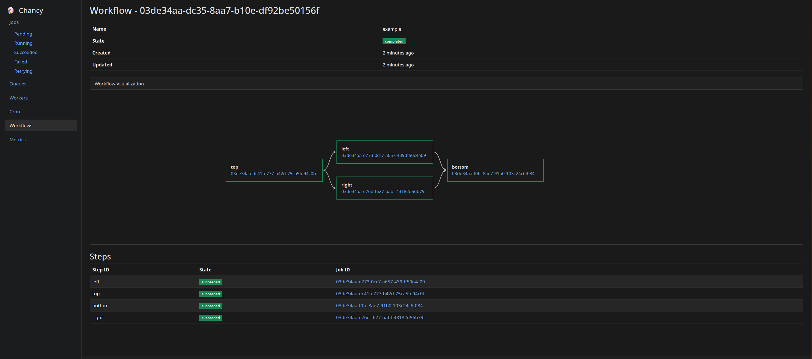
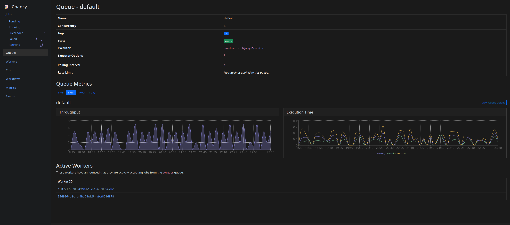

# Chancy

A postgres-backed task queue for Python.

## Key Features

- Support for job priorities, retries, timeouts, scheduling,
  global rate limits, memory limits, unique jobs, and more
- asyncio-based worker with support for asyncio, threaded,
  process-based, and sub-interpreter job execution.
- Configurable job retention for easy debugging and tracking
- Minimal dependencies (only psycopg3 required)
- Plugins for a dashboard, workflows, cron jobs, and more
- Optional transactional enqueueing for atomic job creation
- asyncio & sync APIs for easy integration with existing codebases

## Documentation

Check out the getting-started guide and the API documentation at
https://tkte.ch/chancy/.

## Screenshots

Chancy comes with an optional dashboard that provides a basic
look into the status of your queues:

